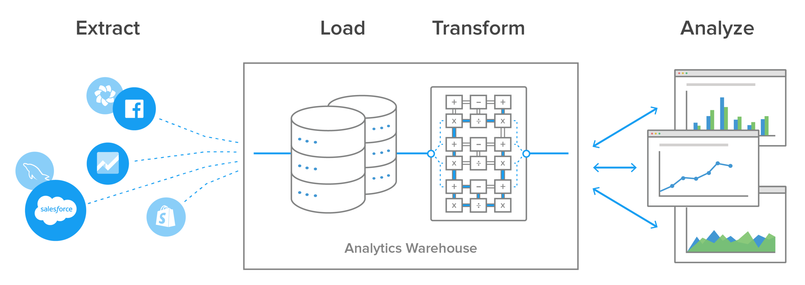

"""""""""""""""""
Job Grabber ETL
"""""""""""""""""
.. contents:: Overview
   :depth: 2

============
Introduction
============

This is project scrape job details from a job website, transforms it and load, and saves the resulting data into ``MySQL`` and ``csv`` respectively.
A dashboard is also created from the final data.

.. class:: center
    A comtemporary ETL process. `Image source <https://www.stitchdata.com/etldatabase/etl-process/>`_

---------------
E - Extraction
---------------
Job details are extracted from the job website using ``Selenium``.

-------------------
T - Transformation
-------------------
The extracted text is cleaned, converted to dataframe then the most frequent words (set to 50 terms for now) are retrieved from the text using ``NLTK``.

---------
L - Load
---------
The transformed data from the previous step is loaded into ``MySQL`` database while the most frequent word is saved as ``csv``.

---------------
Visualization
---------------
From the loaded data, a dashboard is built using ``Streamlit``.

---------------
Libraries used:
---------------
- ``Selenium``
- ``NLTK``
- ``SQLAlchemy``
- ``Pandas``

=========
Todo:
=========
- Workflow automation with ``Airflow`` to run the job once a week (webscrapping can be load intensive, so you do not want to overload a site).
- Add more insight to the visualization
